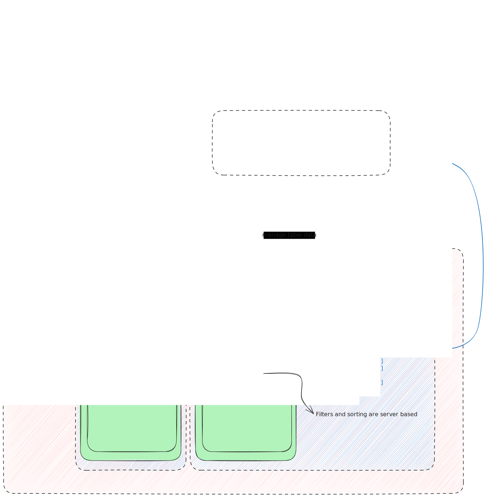

# React Scanner Table

This project is based on Vite `react-ts` template and use `@heroui/react` components library.

## Development

Run `npm run dev` command to start development

>Note: `ScannerTable` component uses virtualization which provides efficient rendering of large lists by only rendering items that are visible in the viewport.
>But in development mode rendering performance will be slightly degraded until this application is built for production.

Vite config file `vite.config.ts` has a proxy server declaration. It is frees you from using a no-cors extension during development.

```ts
server: {
    proxy: {
      "/api": {
        target: "https://api-rs.dexcelerate.com",
        changeOrigin: true,
        rewrite: (path) => path.replace(/^\/api/, ""),
      },
      "/socket": {
        target: "wss://api-rs.dexcelerate.com",
        ws: true,
        secure: true,
        changeOrigin: true,
        rewrite: (path) => path.replace(/^\/socket/, "/ws"),
      },
    },
  },
```

## App simple dataflow scheme


